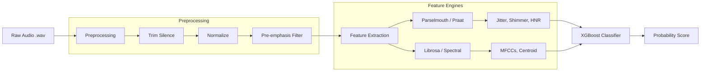
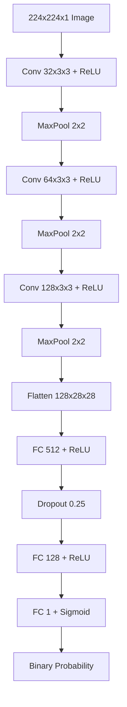
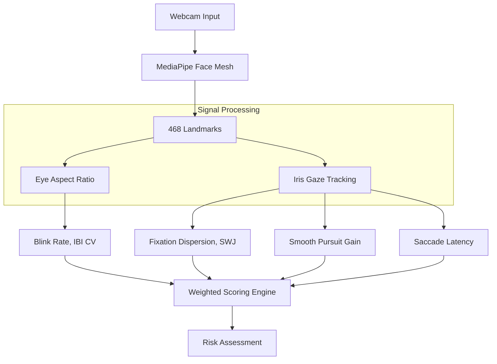

# Detailed Model Analysis: Parkinson's Disease Detection System

This document provides a technical deep-dive into the three specialized AI models used in the Parkinson's Disease (PD) detection system.

---

## 1. Voice Analysis Model (XGBoost)

The voice engine analyzes vocal dysphonia, a common early symptom of Parkinson's characterized by tremors, reduced volume, and breathiness.

### **Voice Engine Pipeline Diagram**

### **Architecture: Extreme Gradient Boosting (XGBoost)**
- **Type**: Gradient Boosted Decision Trees ensemble.
- **Model File**: [voice_xgb_model.pkl](file:///c:/Users/ayush/Downloads/fianl%20mera%20project/models/voice_xgb_model.pkl)
- **Hyperparameters**:
    - `n_estimators`: 500
    - `learning_rate`: 0.01 (Optimized for generalization)
    - `max_depth`: 7
    - `subsample`: 0.8
    - `tree_method`: `hist` (GPU Accelerated)
- **Input**: 26-dimensional feature vector extracted from raw audio.
- **Output**: Probability score (0.0 to 1.0) for Parkinson's detection.

### **Dataset: KCL (King's College London)**
- **Subsets**: `ReadText` (Formal speech) and `SpontaneousDialogue` (Conversational speech).
- **Classes**: `HC` (Healthy Control) and `PD` (Parkinson's Disease).
- **Augmentation**: Temporal features (MFCC Diffs) are calculated to capture the dynamic change in vocal tract shape over time.

### **Feature Extraction Pipeline**
The system extracts 26 clinical features using `librosa` and `parselmouth` (Praat):

1.  **Pitch & Vocal Fold Dynamics**:
    - **Jitter (Local, Absolute, RAP, PPQ5)**: Measures frequency instability. $Jitter = \frac{1}{N-1} \sum |T_i - T_{i+1}|$ where $T$ is the period.
    - **Shimmer (Local, dB, APQ3, APQ5, DDA)**: Measures amplitude instability. $Shimmer = \frac{1}{N-1} \sum |A_i - A_{i+1}|$ where $A$ is the peak amplitude.
    - **HNR (Harmonic-to-Noise Ratio)**: $HNR = 10 \cdot \log_{10}(\frac{E_{periodic}}{E_{noise}})$.
2.  **Spectral Features**:
    - **MFCCs (13 coefficients)**: Captures the shape of the vocal tract (Mel-Frequency Cepstral Coefficients).
    - **Spectral Centroid, Bandwidth, and Rolloff**: Analyzes the distribution of energy across frequencies.
3.  **Prosodic/Temporal Features**:
    - **Vocalized Duration Ratio**: Percentage of time spent speaking vs. pausing.
    - **Speaking Rate**: Number of vocalized segments per second.

### **Preprocessing Steps**
- **Silence Removal**: Trimming non-vocalized segments using `librosa.effects.trim`.
- **Normalization**: Scaling amplitude to a standard range.
- **Pre-emphasis Filter**: Enhancing high-frequency components to better capture jitters/shimmers.

---

## 2. Handwriting Analysis Model (CNN)

The handwriting engine analyzes digitized spiral drawings to detect micro-tremors and kinematic irregularities.

### **CNN Architecture Diagram**

### **Architecture: Convolutional Neural Network (CNN)**
- **Type**: Deep Learning Sequential Model (PyTorch).
- **Model File**: [handwriting_cnn_model.pth](file:///c:/Users/ayush/Downloads/fianl%20mera%20project/models/handwriting_cnn_model.pth)
- **Training Config**:
    - **Epochs**: 30
    - **Optimizer**: Adam (Learning Rate: 0.001)
    - **Loss Function**: Binary Cross-Entropy (BCE) Loss
    - **Hardware**: CUDA GPU (T4/V100)
- **Input**: 224x224 grayscale image of a spiral drawing.
- **Layers**:
    - **Conv Block 1**: 32 filters (3x3), ReLU, MaxPool (2x2).
    - **Conv Block 2**: 64 filters (3x3), ReLU, MaxPool (2x2).
    - **Conv Block 3**: 128 filters (3x3), ReLU, MaxPool (2x2).
    - **Flattening**: $128 \times 28 \times 28$ feature map.
    - **FC Block 1**: 512 units, ReLU, Dropout (0.25).
    - **FC Block 2**: 128 units, ReLU.
    - **Output Layer**: 1 unit, Sigmoid activation.

### **Dataset: Parkinson's vs. Healthy Control**
- **Classes**: `Healthy` and `Parkinson`.
- **Format**: `.png` images of hand-drawn spirals.
- **Classification Approach**: Binary classification between tremor-exhibiting spirals and smooth controls.

### **Preprocessing Pipeline**
- **Grayscale Conversion**: Reducing color dimensionality.
- **Resizing**: Standardizing to 224x224 pixels.
- **Otsu Thresholding**: Segmenting the drawing from the background using adaptive binary thresholding. $T = \arg \max \sigma^2_B(t)$ (Otsu's method).
- **Normalization**: Rescaling pixel values to [0.1, 1.0].

### **Classical Feature Extraction (Supportive)**
While the CNN extracts latent features, the system also calculates:
- **Spiral Area Ratio**: Drawing area vs. bounding box area (detects size/regularity).
- **Hu Moments**: 7 rotation-invariant shape moments.
- **GLCM Texture**: Contrast, energy, and homogeneity of the pen strokes.

---

## 3. Eye Tracking Analysis Model (Heuristic-based)

The eye tracking engine monitors oculomotor behavior, focusing on saccade dynamics and fixation stability.

### **Eye Analysis Flowchart**

### **Core Technology: MediaPipe Face Mesh**
- **Landmarks**: 468 3D facial landmarks.
- **Gaze Tracking**: Iris landmarks (468-477) are used to estimate the gaze center (x, y) relative to the screen.
- **Blink Detection**: Eye Aspect Ratio (EAR) calculated from 16 landmarks per eye.

### **Feature Extraction (25 Clinical Markers)**
The system extracts advanced features from the session data:
1.  **Fixation Stability**:
    - **Dispersion (I-DT Algorithm)**: $D = [\max(x) - \min(x)] + [\max(y) - \min(y)]$.
    - **Square-Wave Jerks (SWJ)**: $SWJ = \sum (\Delta gaze > 0.03 \text{ and } \Delta return < 0.01)$.
2.  **Saccade Dynamics**:
    - **Latency**: Time $(ms)$ from target shift to saccade onset.
    - **Main Sequence Relationship**: $PeakVelocity \propto Amplitude$.
3.  **Smooth Pursuit**:
    - **Pursuit Gain**: $Gain = \frac{\text{Eye Velocity}}{\text{Target Velocity}}$.
    - **Catch-up Saccades**: Count of velocity spikes where $V_{eye} > 2.5 \times V_{target}$.
4.  **Blink Analysis**:
    - **Eye Aspect Ratio (EAR)**: $EAR = \frac{||p2-p6|| + ||p3-p5||}{2||p1-p4||}$.
    - **Blink Rate**: Frequency of EAR drops below 0.2 threshold.

### **Decision Logic (Clinical Heuristics)**
Instead of a single black-box model, the eye engine uses a weighted scoring of these clinical markers:
- **High Risk**: SWJ count > 5, Pursuit Gain < 0.7, Blink Rate < 8/min.
- **Medium Risk**: High fixation dispersion, high saccade latency.

---
