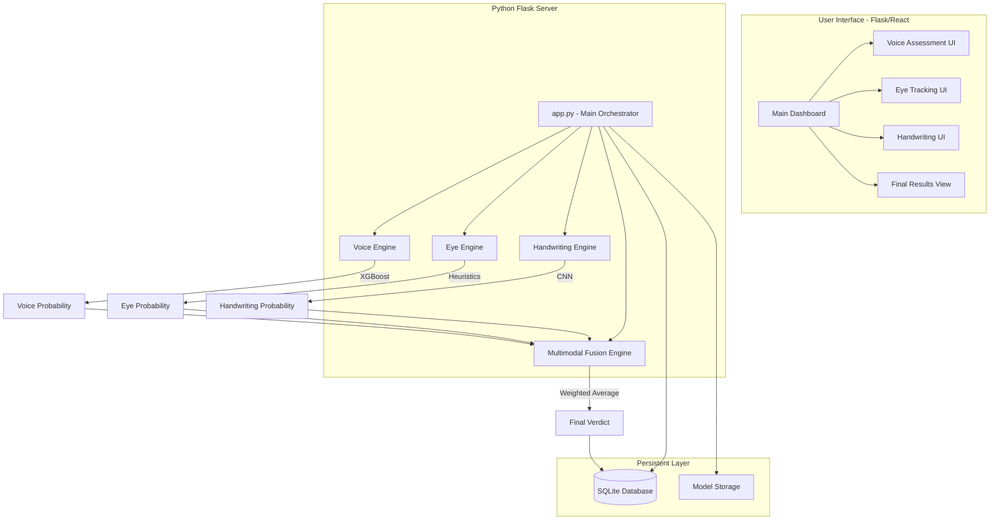
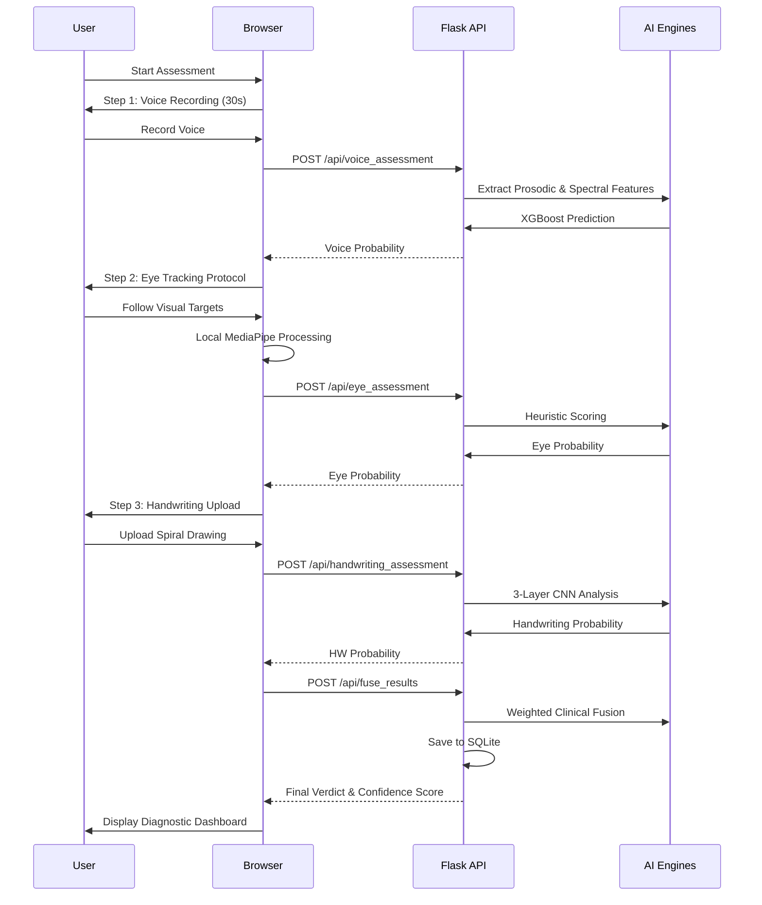

# Multimodal Parkinson's Disease Detection System: Comprehensive Working

This document provides a detailed analysis of the complete multimodal system integration, architecture, and data flow.

---

## 1. System Overview

The system is a distributed AI platform that integrates three distinct physiological modalities to provide a comprehensive neurological assessment for Parkinson's Disease (PD). By combining vocal, oculomotor, and handwriting biomarkers, the system reduces the high variance of individual symptoms across different patients.

---

## 2. Architecture Diagram

The system follows a micro-service inspired architecture designed for clinical scalability and cross-platform accessibility.

### **Component Architecture**

### **Assessment Sequence Flow**

---

## 3. Detailed Data Flow

The assessment follows a structured 4-step protocol to ensure high-quality data collection.

### **Step 1: Voice Data Collection & Processing**
- **Flow**: User records 30 seconds of audio $\rightarrow$ Client sends `.wav` to `/api/voice_assessment`.
- **Backend**:
    - [preprocessing.py](file:///c:/Users/ayush/Downloads/fianl%20mera%20project/voice_engine/preprocessing.py) performs silence removal and normalization.
    - [feature_extraction.py](file:///c:/Users/ayush/Downloads/fianl%20mera%20project/voice_engine/feature_extraction.py) extracts 26 clinical features (Jitter, Shimmer, HNR, MFCCs).
    - [app.py](file:///c:/Users/ayush/Downloads/fianl%20mera%20project/backend/app.py) passes features to [voice_xgb_model.pkl](file:///c:/Users/ayush/Downloads/fianl%20mera%20project/models/voice_xgb_model.pkl).

### **Step 2: Eye Tracking Session & Analysis**
- **Flow**: User follows a 4-part protocol (Fixation $\rightarrow$ Prosaccade $\rightarrow$ Pursuit $\rightarrow$ Blink) $\rightarrow$ Client tracks iris in real-time via **MediaPipe** $\rightarrow$ Session data sent to `/api/eye_assessment`.
- **Backend**:
    - [feature_extraction.py](file:///c:/Users/ayush/Downloads/fianl%20mera%20project/eye_tracking/feature_extraction.py) calculates 25 advanced oculomotor metrics.
    - [app.py](file:///c:/Users/ayush/Downloads/fianl%20mera%20project/backend/app.py) applies clinical heuristics (e.g., SWJ count, pursuit gain) to determine risk.

### **Step 3: Handwriting Image Classification**
- **Flow**: User uploads a spiral drawing image $\rightarrow$ Client sends `.png` to `/api/handwriting_assessment`.
- **Backend**:
    - [preprocessing.py](file:///c:/Users/ayush/Downloads/fianl%20mera%20project/handwriting_engine/preprocessing.py) converts to grayscale and resizes to 224x224.
    - [model.py](file:///c:/Users/ayush/Downloads/fianl%20mera%20project/handwriting_engine/model.py) passes the tensor through a 3-layer CNN.

### **Step 4: Multimodal Fusion & Verdict**
- **Flow**: All individual probabilities are sent to `/api/fuse_results`.
- **Backend**:
    - [fusion.py](file:///c:/Users/ayush/Downloads/fianl%20mera%20project/fusion_engine/fusion.py) calculates the weighted ensemble probability.
    - The final verdict is stored in [parkinsons_detection.db](file:///c:/Users/ayush/Downloads/fianl%20mera%20project/backend/parkinsons_detection.db) for historical tracking.

---

## 4. Multimodal Fusion Engine

The fusion engine is the core intelligence layer that combines the outputs of the three AI engines.

### **Weighted Averaging Logic**
The system uses a prioritized weighting system based on clinical sensitivity:
- **Voice ($w_v = 0.45$)**: Highest priority due to high sensitivity in early prodromal stages.
- **Handwriting ($w_h = 0.35$)**: Secondary priority for detecting motor tremors.
- **Eye Tracking ($w_e = 0.20$)**: Tertiary priority as a supportive diagnostic marker.

### **Dynamic Weight Normalization**
The engine is designed to handle missing data. If a module is skipped or fails, the weights are normalized:
$P_{final} = \frac{\sum w_i P_i}{\sum w_i}$
Example: If the Eye Tracking module is missing:
$P_{final} = \frac{0.45 P_{voice} + 0.35 P_{handwriting}}{0.45 + 0.35}$

---

## 5. Clinical Verdict Logic

The system translates mathematical probabilities into clinical actions using a binary classification threshold:
- **Threshold ($T = 0.50$)**:
    - $P_{final} \ge 0.50$: **Parkinson's Disease Likely**
    - $P_{final} < 0.50$: **Healthy**

---

## 6. Integration and Database

The system uses [database.py](file:///c:/Users/ayush/Downloads/fianl%20mera%20project/backend/database.py) to manage a SQLite database (`parkinsons_detection.db`).

### **Schema Details**
- **`assessments` Table**:
    - `id`: Primary Key.
    - `timestamp`: Auto-generated date/time.
    - `voice_prob`, `eye_prob`, `handwriting_prob`: Individual module scores.
    - `final_prob`: Fused result.
    - `verdict`: Clinical string ("Healthy" or "Parkinson's Disease Likely").
    - `user_id`: Optional identifier (default: "anonymous").
- **`feature_logs` Table**:
    - Stores raw clinical features in JSON format for longitudinal analysis and model retraining.

## 7. Frontend & Hardware Access

The user interface is built for high-performance data acquisition in a web browser:
- **MediaPipe (Wasm)**: Runs the 468-landmark Face Mesh model locally on the client's GPU via WebGL, ensuring privacy and low latency.
- **WebAudio API**: Captures raw PCM data at 44.1kHz/48kHz for high-fidelity voice analysis.
- **Canvas API**: Provides real-time visual feedback (waveform and gaze target) during the assessment protocol.
- **Secure Contexts**: Hardware access is restricted to `localhost` or `HTTPS` for privacy.
---
